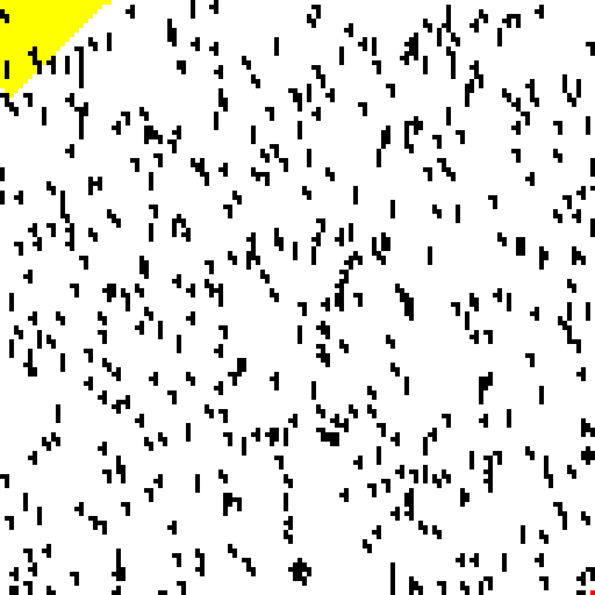
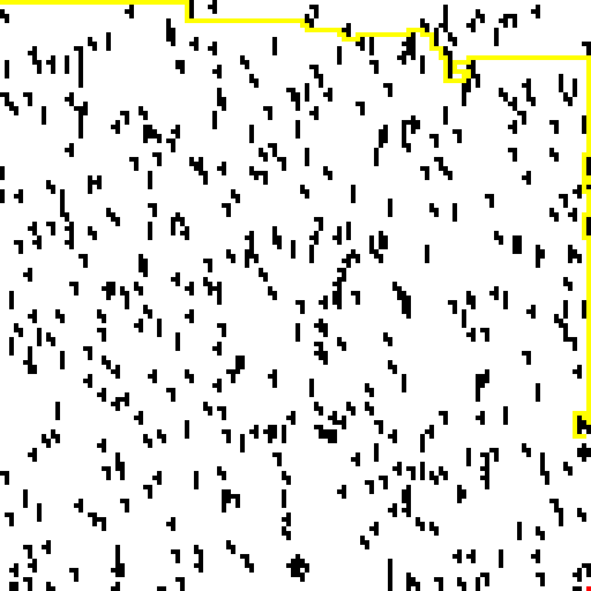

**Homework 1**

**HW 1: Breadth-First Search and Depth-First Search Implementation**

**Table of Contents**
<!-- TOC -->

- [Introduction](#introduction)
- [Breadth-First Search BFS](#breadth-first-search-bfs)
    - [Pseudocode](#pseudocode)
    - [Code Explaination](#code-explaination)
- [Depth-First Search DFS](#depth-first-search-dfs)
    - [Pseudocode: Iterative Version](#pseudocode-iterative-version)
    - [Pseudocode: Recursive Version](#pseudocode-recursive-version)
    - [Code Explaination](#code-explaination)
- [Dijkstra Search](#dijkstra-search)
    - [Pseudocode](#pseudocode)
    - [Code Explaination](#code-explaination)
- [Run the code](#run-the-code)
- [Results](#results)
- [Resources](#resources)

<!-- /TOC -->

# Introduction

Breadth-First Search (BFS) and Depth-First Search (DFS) are two of the introductory search algorithm for path planning.
- DFS focuses on planning path as fast as possible but fails at guaranteeing the shortest path.
- BFS focuses on providing the shortest path by scanning the whole environment but is time and memory intensive.
- Dij


# Breadth-First Search (BFS)

**Breadth-first search (BFS)** is an algorithm for searching a tree data structure for a node that satisfies a given property. It starts at the tree root and explores all nodes at the present depth prior to moving on to the nodes at the next depth level. Extra memory, usually a queue, is needed to keep track of the child nodes that were encountered but not yet explored.

Order in which nodes are visited:


## Pseudocode

```python
BFS (G, s) # Where G is the graph and s is the source node
    let Q be queue.
    Q.enqueue( s ) # Inserting s in queue until all its neighbour vertices are marked.
    mark s as visited.

        while ( Q is not empty)
            v  =  Q.dequeue( )# Removing that vertex from queue,whose neighbour will be visited now

            for all neighbours w of v in Graph G # processing all the neighbours of v  
                if w is not visited 
                    Q.enqueue( w ) # Stores w in Q to further visit its neighbour
                    mark w as visited.
```

BFS Search Simulation:


## Code Explaination

Define function to implement BFS Algorithm.

```python
def bfs(grid, start, goal):
```

Initialize the basic requirements for the implementation. BFS requires a **queue** (FIFO).

```python
path = []
steps = 0
found = False

x_queue = queue.Queue()
y_queue = queue.Queue()
p_queue = queue.Queue()

final_path = ''
```

Append the start position information into the queue.

```python
x_queue.put(x)
y_queue.put(y)
p_queue.put("")
```

Mark the Start Node as visited.

```python
y, x = start
grid[y][x] = 2
```
Run the loop until the queue is empty

```python
while not x_queue.empty():
```

Pop the first element from queue for x, y and path

```python
    x = x_queue.get()
    y = y_queue.get()
    path_search = p_queue.get()
```

Check if the popped element is the end position, exit the loop if it is.

```python
    if ((y == goal[0]) and (x == goal[1])):
        final_path = path_search
        found = True
        break
```

Check for the empty elements around the cell, add it in queue if they are empty and marked them as visited.

```python
    if (is_right_empty(grid, y, x, 'queue', x_queue, y_queue)):
        p_queue.put(path_search+'R')
    if (is_down_empty(grid, y, x, 'queue', x_queue, y_queue)):
        p_queue.put(path_search+'D')
    if (is_left_empty(grid, y, x, 'queue', x_queue, y_queue)):
        p_queue.put(path_search+'L')
    if (is_up_empty(grid, y, x, 'queue', x_queue, y_queue)):
        p_queue.put(path_search+'U')
```

If the end goal is reached, deparse the path (string) and convert it into cell positions.

```python
if found:
    steps, path = list_path(start, final_path)
```

Return the information. The path(cell positions) and number of steps needed to reach end position is returned.

```python
if found:
    print(f"It takes {steps} steps to find a path using BFS")
else:
    print("No path found")
return path, steps
```

# Depth-First Search (DFS)

**Depth-first search (DFS)** is an algorithm for traversing or searching a tree or graph data structure. The algorithm starts from the root node (choose any node as the root in the case of a graph) and explores along each branch as possible before backtracking. Additional memory (usually a stack) is required to keep track of the nodes discovered so far along a given branch, which facilitates graph backtracking.

Order in which nodes are visited:


The time and space analysis of DFS differs according to its application area. In theoretical computer science, DFS is typically used to traverse an entire graph, and takes time $O(|V|+|E|)$
, where $|V|$ is the number of vertices and $|E|$ the number of edges. This is linear in the size of the graph. In these applications it also uses space $O(|V|)$ in the worst case to store the stack of vertices on the current search path as well as the set of already-visited vertices. Thus, in this setting, the time and space bounds are the same as for breadth-first search and the choice of which of these two algorithms to use depends less on their complexity and more on the different properties of the vertex orderings the two algorithms produce.

Two versions of DFS algorithm that exists:
- Iterative Version (We have programmed this version)
- Recursive Version

## Pseudocode: Iterative Version

```python
DFS-iterative (G, s): # Where G is graph and s is source vertex
    let S be stack
    S.push( s ) # Inserting s in stack 
    mark s as visited.
    
    while ( S is not empty):
        v  =  S.top( ) # Pop a vertex from stack to visit next
        S.pop( )
        for all neighbours w of v in Graph G: # Push all the neighbours of v in stack that are not visited   
            if w is not visited :
                    S.push( w )         
                    mark w as visited
```

## Pseudocode: Recursive Version

```python
DFS-recursive(G, s):
    mark s as visited
    for all neighbours w of s in Graph G:
        if w is not visited:
            DFS-recursive(G, w)
```

DFS Search Simulation:


## Code Explaination

Define function to implement DFS Algorithm.

```python
def dfs(grid, start, goal):
```

Initialize the basic requirements for the implementation. DFS requires a **stack** (LIFO). A list can be a good implementation to replicate the stack.

```python
path = []
steps = 0
found = False

x_stack = []
y_stack = []
p_stack = []

final_path = ''
```

Append the start position information into the stack

```python
y_stack.append(start[0])
x_stack.append(start[1])
p_stack.append('')
```

Mark the Start Node as visited.

```python
y, x = start
grid[y][x] = 2
```

Run the loop until the stack is empty

```python
while (len(x_stack) != 0):
```

Pop the top element from stack for x, y and path

```python
    y = y_stack.pop()
    x = x_stack.pop()
    path_search = p_stack.pop()
```

Check if the popped element is the end position, exit the loop if it is.

```python
    if ((y == goal[0]) and (x == goal[1])):
        final_path = path_search
        found = True
        break
```

Check for the empty elements around the cell, add it in stack if they are empty and marked them as visited.

```python
    if (is_right_empty(grid, y, x, 'stack', x_stack, y_stack)):
        p_stack.append(path_search+'R')
    if (is_down_empty(grid, y, x, 'stack', x_stack, y_stack)):
        p_stack.append(path_search+'D')
    if (is_left_empty(grid, y, x, 'stack', x_stack, y_stack)):
        p_stack.append(path_search+'L')
    if (is_up_empty(grid, y, x, 'stack', x_stack, y_stack)):
        p_stack.append(path_search+'U')
```

If the end goal is reached, deparse the path (string) and convert it into cell positions.

```python
if found:
    steps, path = list_path(start, final_path)
clear_grid(grid)
```

Return the information. The path(cell positions) and number of steps needed to reach end position is returned.

```python
if found:
    print(f"It takes {steps} steps to find a path using DFS")
else:
    print("No path found")
return path, steps
```

# Dijkstra Search

**Dijkstra search** to find the shortest path between $a$ and $b$. It picks the unvisited vertex with the lowest distance, calculates the distance through it to each unvisited neighbor, and updates the neighbor's distance if smaller. Mark visited (set to red) when done with neighbors.


Dijkstra's Algorithm solves the single source shortest path problem in $O((E + V)logV)$ time, which can be improved to $O(E + VlogV)$ when using a Fibonacci heap.

## Pseudocode

```python
function dijkstra(G, S)
    for each vertex V in G
        distance[V] <- infinite
        previous[V] <- NULL
        If V != S, add V to Priority Queue Q
    distance[S] <- 0
	
    while Q IS NOT EMPTY
        U <- Extract MIN from Q
        for each unvisited neighbour V of U
            tempDistance <- distance[U] + edge_weight(U, V)
            if tempDistance < distance[V]
                distance[V] <- tempDistance
                previous[V] <- U
    return distance[], previous[]
```

## Code Explaination

Define function to implement DFS Algorithm.

```python
def dfs(grid, start, goal):
```

Initialize the basic requirements for the implementation. DFS requires a **stack** (LIFO). A list can be a good implementation to replicate the stack.

```python
path = []
steps = 0
found = False

x_stack = []
y_stack = []
p_stack = []

final_path = ''
```

Append the start position information into the stack

```python
y_stack.append(start[0])
x_stack.append(start[1])
p_stack.append('')
```

Mark the Start Node as visited.

```python
y, x = start
grid[y][x] = 2
```

Run the loop until the stack is empty

```python
while (len(x_stack) != 0):
```

Pop the top element from stack for x, y and path

```python
    y = y_stack.pop()
    x = x_stack.pop()
    path_search = p_stack.pop()
```

Check if the popped element is the end position, exit the loop if it is.

```python
    if ((y == goal[0]) and (x == goal[1])):
        final_path = path_search
        found = True
        break
```

Check for the empty elements around the cell, add it in stack if they are empty and marked them as visited.

```python
    if (is_right_empty(grid, y, x, 'stack', x_stack, y_stack)):
        p_stack.append(path_search+'R')
    if (is_down_empty(grid, y, x, 'stack', x_stack, y_stack)):
        p_stack.append(path_search+'D')
    if (is_left_empty(grid, y, x, 'stack', x_stack, y_stack)):
        p_stack.append(path_search+'L')
    if (is_up_empty(grid, y, x, 'stack', x_stack, y_stack)):
        p_stack.append(path_search+'U')
```

If the end goal is reached, deparse the path (string) and convert it into cell positions.

```python
if found:
    steps, path = list_path(start, final_path)
clear_grid(grid)
```

Return the information. The path(cell positions) and number of steps needed to reach end position is returned.

```python
if found:
    print(f"It takes {steps} steps to find a path using DFS")
else:
    print("No path found")
return path, steps
```

# Run the code
Open a new terminal inside this folder and run:

```shell
make
```

# Results

- Breadth-First Search (BFS)

    

- Depth-First Search (DFS)

    

- Dijkstra Search

    

- Start: [1,1], Goal: [128,128] - BFS vs DFS vs Dijkstra

    

- Start: [50,50], Goal: [124,22] - BFS vs DFS vs Dijkstra

    

# Resources

- [HackerEarth: Depth First Search](https://www.hackerearth.com/practice/algorithms/graphs/depth-first-search/tutorial/)
- [HackerEarth: Breadth First Search](https://www.hackerearth.com/practice/algorithms/graphs/breadth-first-search/tutorial/)
- [HackerEarth: Dijkstra's Algorithm](https://www.hackerearth.com/practice/notes/dijkstras-algorithm/)
- [Stackoverflow: Stitching Photos together](https://stackoverflow.com/questions/10657383/stitching-photos-together)